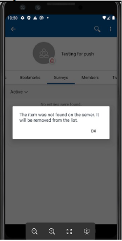

<?xml version="1.0" encoding="UTF-8"?>
<!DOCTYPE task PUBLIC "-//OASIS//DTD DITA Task//EN" "task.dtd">

#  October, 2020 MT fixpack, MT customers should update mobile-config.xml 

**Issue**
October, 2020 MT fixpack, all MT customers should update their mobile-config.xml under the DMgr path.

A customer that migrated data from an IBM cloud community that contained Surveys will see a Surveys tab within the community when using the Connections mobile app on a mobile device. If the user selects the Surveys tab, they will see an error like below:
Image reference.



**Expected result**

Surveys are not supported in a MT environment. They should not display on a mobile device within the Connections mobile app.

**Solution**
In the October, 2020 MT fixpack, all MT customers should update their mobile-config.xml to explicitly disable Surveys. The mobile-config.xml file can be located on the DMgr node.

Search for this section

```
<Surveys enabled="true"> 
   <SurveysUrl>/surveys</SurveysUrl> 
</Surveys>
```

Change enabled="true" to enabled="false".

Save the file, do a full sync of all nodes, and then restart the Mobile application.

<?tm 1541016643182 1 HCL Connections ?>

