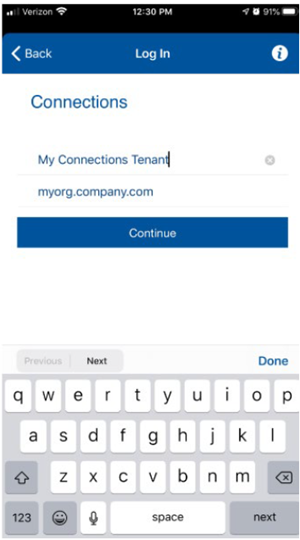

<?xml version="1.0" encoding="UTF-8"?>
<!DOCTYPE task PUBLIC "-//OASIS//DTD DITA Task//EN" "task.dtd">

# Using the Connections Mobile app
User’s of the app must use the “My company’s server” option in the account setup wizard and then enter the hostname of their MT deployment server. A full URL is not required. For example:

Touch Continue and the user will be presented with their company’s login screen (or the hosting company’s screen, depending on how Keycloak is setup for this user).
<?tm 1541016643182 1 HCL Connections ?>

