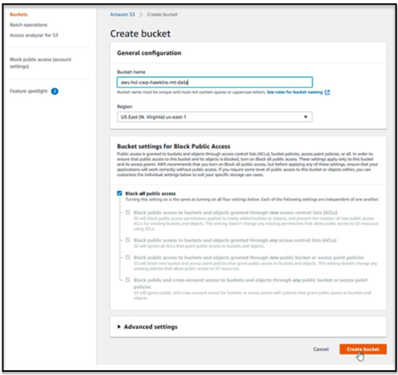
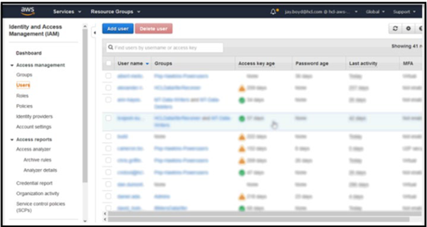
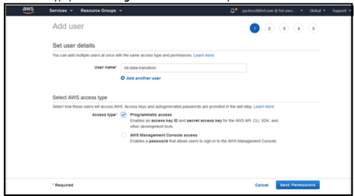
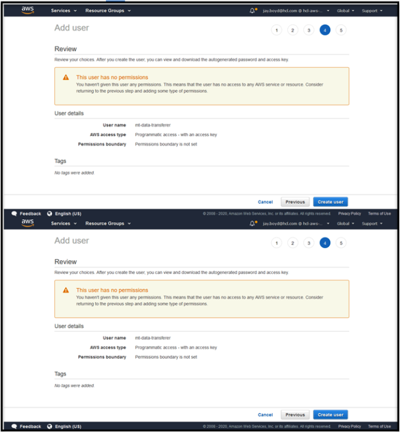
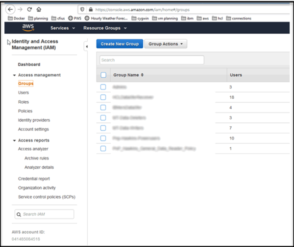
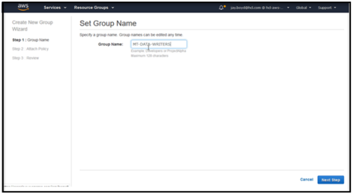
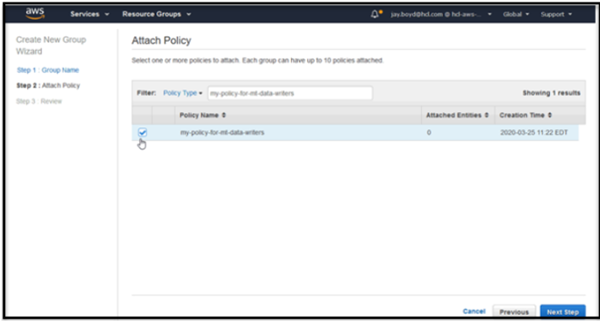
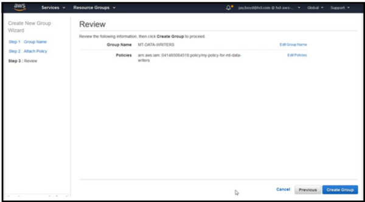
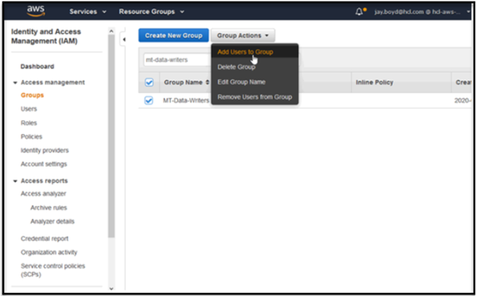
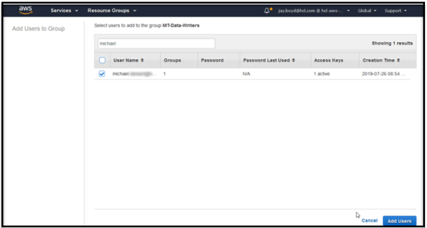

<?xml version="1.0" encoding="UTF-8"?>
<!DOCTYPE task PUBLIC "-//OASIS//DTD DITA Task//EN" "task.dtd">

# Setting up an S3 bucket

**Prerequisite: An AWS account**

  1. Log in to the AWS console and open the Buckets page:[https://s3.console.aws.amazon.com/s3/home](https://apc01.safelinks.protection.outlook.com/?url=https%3A%2F%2Fs3.console.aws.amazon.com%2Fs3%2Fhome%3Fregion%3Dus-east-1&amp;data=02%7C01%7Cmichael.stewart%40hcl.com%7Cbd15fc81caa34d8f575908d7d00f4c6e%7C189de737c93a4f5a8b686f4ca9941912%7C0%7C0%7C637206636444748608&amp;sdata=%2FbsCNlpvUs3MxwJRN1jjTbXr%2B%2BvypLUWNsmi0IweFz0%3D&amp;reserved=0)
  
  2. Click **Create bucket**.
  
  3. Specify a bucket name and make sure **Block all public access** is checked.
  
      
      
  4. Use the AWS command line interface to  create two new policies, for  writers and readers.
  
      1. Paste the JSON below into two text files, one for  each policy. In the Resource section, replace *aws-hcl-cwp-hawkins- mt-data* with your bucket name.
      
         **Data Writers Policy**
      
         ```
         {
           "Version": "2012-10-17",
           "Statement": [
           {
               "Effect": "Allow", 
               "Action": [
                 "s3:ListBucket", 
                 "s3:ListBucketMultipartUploads", 
                 "s3:ListBucketVersions"
           ],
           "Resource": [
             "arn:aws:s3:::aws-hcl-cwp-hawkins-mt-data"
          ]
         },
         {
              "Effect": "Allow", 
              "Action": [
                "s3:PutObject", 
                "s3:GetObject", 
                "s3:PutObjectVersionAcl",

                "s3:AbortMultipartUpload"
            ],
            "Resource": [
              "arn:aws:s3:::aws-hcl-cwp-hawkins-mt-data/*"
            ]
           }
          ]
         }
         ```
         Data-Readers policy
         
         ```
         {
           "Version": "2012-10-17",
           "Statement": [
              { 
                "Effect": "Allow", 
                "Action": [
                  "s3:ListBucket"
                ],
                "Resource": [
                  "arn:aws:s3:::aws-hcl-cwp-hawkins-mt-data"
                ]
              },
              {
                "Effect": "Allow", 
                "Action": [
                  "s3:GetObject"
                ],
                "Resource": [
                  "arn:aws:s3:::aws-hcl-cwp-hawkins-mt-data/*"
                ]
               }
              ]
             }
         ```

        1. Save the files as writers.json and readers.json.
    
        2. In a command prompt window, enter the following commands and ensure they run without error:

           - awsiamcreate-policy--policy-namemy-policy-for-mt-data-writers--policy-document file://writers.json
           - awsiamcreate-policy--policy-namemy-policy-for-mt-data-readers--policy-document file://readers.json

  5. Go to the Identity and Access Management page: [https://console.aws.amazon.com/iam/home](https://apc01.safelinks.protection.outlook.com/?url=https%3A%2F%2Fconsole.aws.amazon.com%2Fiam%2Fhome%3Fregion%3Dus-east-1%23%2Fhome&amp;data=02%7C01%7Cmichael.stewart%40hcl.com%7Cbd15fc81caa34d8f575908d7d00f4c6e%7C189de737c93a4f5a8b686f4ca9941912%7C0%7C0%7C637206636444748608&amp;sdata=7TqacD7jkH0ZPXrQFrVntAaE2ilozl8nGsu96pqy6xc%3D&amp;reserved=0)
  
  6. Click **Users** and then **Add user**.
  
     

  7. Specify the user name and access type. User names may not contain spaces. They can contain alphanumeric characters, or any of the following: \ _ + = , @ -.  Add the user **ics-smartcloud-operations@wwpdl.vnet.ibm.com** and for access type, choose **Programmatic access** only.
  
     

  8. Click **Next** until you reach the Review screen.  Do not add any privileges to the user. Privileges are defined in the policies you created. These are applied when you create usergroups, attach the policies, and add users to the groups.
  
     

  9. Click **Create user**. You should see a &quot;success&quot;message.
 

  10. **Important:** Click **Show** and copy the access key id and secret access key displayed. You must give these to the user. You must also give the id and key for **ics-smartcloud-operations@wwpdl.vnet.ibm.com** to HCL Support. Once you leave this page you will not have access to the secret access key again.

  11. Repeat as needed for other users.

  12. For each policy that you created earlier, create a group and attach the appropriate policy to it. In the left-hand navigation,click *Groups*.

  13. Click **Create New Group**.
  
      

  14. Use the group creation wizard to set the group name, attach the correct policy, and review your choices.
      
      
      
      
      

  15. When you are satisfied with your choices, click **Create Group**.
  
  16. Repeat the group creation steps for the other policy you created.
  
  17. Add users to your groups. Select a group and click **Group Actions** > Add **Users to Group**.
      

  18. Select users and click **Add Users**. Add **ics-smartcloud-operations@wwpdl.vnet.ibm.com** to the data writers group and the data readers group.
  
      

  19. Repeat the user addition for the other group.

<?tm 1541016643182 1 HCL Connections ?>


