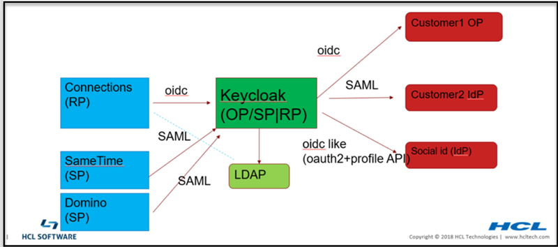

<?xml version="1.0" encoding="UTF-8"?>
<!DOCTYPE task PUBLIC "-//OASIS//DTD DITA Task//EN" "task.dtd">
# Understanding the Keycloak dependency

**Note:** The dotted line from connections to ldap is not required for authentication. It may be used for group support from application level. Although it should really be done using keycloak APIs, the existing code may be doing a direct ldap call.

<?tm 1541016643182 1 HCL Connections ?>

