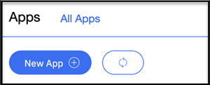
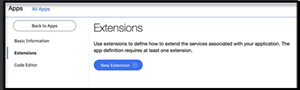
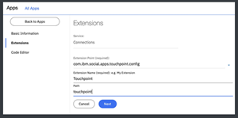
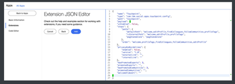
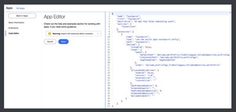

# Setting up Touchpoint MT for an Org (touchpont-config.xml)

After [Installing Touchpoint](https://help.hcltechsw.com/connections/v6/admin/install/t_install_touchpoint.html), perform the following instructions to set up and configure Touchpoint for MT.    

1.  Open the App Registry (endpoint /appreg/apps)
2.  Create a new App  

       
         
3.  Provide the following information
      - Appname: 'Touchpoint'
      - Description: 'An App that helps onboarding users'  

       
  
4.  Create a new Extension  

       
  
5.  Provide the following information
      - Extension Point: 'com.ibm.social.apps.touchpoint.config'
      - Extension Name: 'Touchpoint'
      - Path: 'touchpoint'  

        
  
6.  Replace the empty payload property with the default config JSON,  refer to the Default JSON section.   

        
  
7.  Switch to 'Code Editor' to check validity of inputs and proper formatting, refer to the Sample JSON section.  

        
  
8.  Save configuration

**Default JSON**

```
{
    "uiEnabled": false,
     "steps": {
        "paths": {
           "defaultPath":
"welcome,editProfile,findColleagues,followCommunities,profileTags",
           "icExternalPath": "welcome,editProfile,profileTags",
           "pagStandalone": "pagStandalone"
        },
        "order":
"welcome,profileTags,findColleagues,followCommunities,editProfile"
    },
    "privacyAndGuidelines": {
        "enabled": false,
        "version": "1.0",
        "externalLink": "",
        "internalLink": ""
    },
    "maxPromotedExperts": 3,
    "promotedExperts": "",
    "maxPromotedCommunities": 3,
    "promotedCommunities": "",
    "welcomeVideoUrl": ""  
}    
```

**Sample JSON**

The following is a sample JSON you can copy and paste into the code editor of your App Registry Touchpoint App

```
{
    "name": "Touchpoint", 
    "title": "Touchpoint",
    "description": "An App that helps onboarding users", 
    "services": [
        "Connections"
    ],
    "extensions": [
        {
            "name": "Touchpoint",
            "type": "com.ibm.social.apps.touchpoint.config", 
            "payload": {
                 "uiEnabled": false, 
                 "steps": {
                     "paths": {                 
                        "defaultPath": 
"welcome,editProfile,findColleagues,followCommunities,profileTags",
                        "icExternalPath": 
"welcome,editProfile,profileTags",
                        "pagStandalone": "pagStandalone"
                    },
                    "order": 
"welcome,profileTags,findColleagues,followCommunities,editProfile"
                },
                "privacyAndGuidelines": { 
                    "enabled": false, 
                    "version": "1.0",
                    "externalLink": "", 
                    "internalLink": ""
                },
                "maxPromotedExperts": 3, 
                "promotedExperts": "", 
                "maxPromotedCommunities": 3, 
                "promotedCommunities": "", 
                "welcomeVideoUrl": ""
          },
          "path": "touchpoint"
       }
    ]
}
```
