# Enabling single sign-on (SSO) using Keycloak Authentication

Enabling SSO in an MT environment involves Keycloak providing identity authentication brokering between  WebSphere OIDC (Connections application side server) and possibly multiple customer IdPs. This SSO is accomplished by setting up a trust relationship between the Connections server and Keycloak using the IBM WebSphere OpenID Connect Relying Party Trust Association Interceptor (OIDC Relying Party TAI). Keycloak is then used as an intermediary to broker authentication to the customer IdP.

Enabling this single sign-on OIDC authentication between Keycloak and  Connections involves completing multiple steps:

- Brokering authentication using hint (you broker each org to their respective Identity Provider)
- Configuring KeyCloak as OIDC Provider for Connections
- Updating WebSphere to support single sign-on (SSO) between Keycloak with Connections
- Configuring Connections 

For background on OIDC (OpenID Connect), you can see these topics in the IBM documentation for WebSphere Application Server:

- OpenID Connect overview  https://www.ibm.com/docs/en/was/8.5.5?topic=users-openid-connect-overview
-[Configuring an OpenID Relying Party](https://www.ibm.com/docs/en/was/8.5.5?topic=users-configuring-openid-relying-party)    

## Brokering Authentication via Hint

The following image shows a possible MT configuration with three customer IdPs each using a separate protocol OIDC, SAML and a social id.

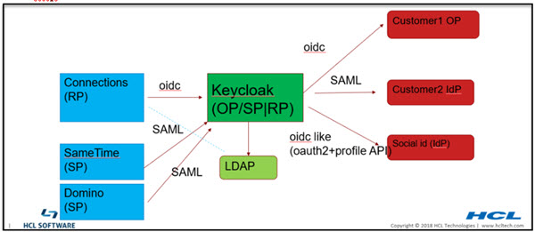
<br>

**Note:** The dotted line from connections to LDAP is not required for authentication. It may be used for group support from application level. Although it should really be done using keycloak APIs, the existing code may be doing a direct LDAP call.


In MT, most of customers have their own IdP to authenticate users so Connections can SSO to customers own applications that use the same IdP.

**Keycloak Identity Providers Example**
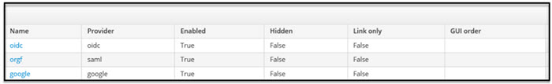

By default, a user would have to pick which login to use. However we can remove this page by redirect the user to their org's IdP.

This can be done by using [kc_idp_hint](https://www.keycloak.org/docs/latest/server_admin/#_client_suggested_idp). 

The redirect URL contains a unique organization string which allows creating a rewrite rule to map between the organization and the organization IdP.

For example,

```
https://\

{KK}/realms/{RM}/protocol/openid-connect/auth?xxxxx&redirect_uri=https%3A%2F%2Fmtdemo1- orgc.cnx.cwp.pnp-hcl.com%3A443%2Foidcclient_apps%2Fkeycloak&yyyyy

```

to

```
https://\{KK}

/realms/{RM}/protocol/openid-connect/auth?xxxxx&redirect_uri=https%3A%2F%2Fmtdemo1-orgc.cnx.cwp.pnp-
hcl.com%3A443%2Foidcclient_apps%2Fkeycloak&yyyyy&kc_idp_hint=mtdemo1-orgc

```

Example implementation:

```
if ($arg_redirect_uri ~ ^(https.*connmt-orge.*)){
rewrite ^(/auth/.*)/Azure-OIDC/(\w+\.?.*$) $1/Azure-OIDC/$2?kc_idp_hint=google break;
}
if ($arg_redirect_uri ~ ^(https.*connmt-orgf.*)){
rewrite ^(/auth/.*)/Azure-OIDC/(\w+\.?.*$) $1/Azure-OIDC/$2?kc_idp_hint=connmt-orgf break;
     }

```

## Configuring KeyCloak as an OIDC provider for Connections

Configuring Keycloak as the OIDC provider for Connections involves these steps

- Create a realm
- Within that realm create a client for the Connections web application (client)
  - Configure the callback urls
- Configure hardcoded realmName claim via client scope mapper property
- Setup Keycloak connection to LDAP
- Create additional clients for Oauth applications mobile, desktop plugins, rte and ee 

**Creating Connections Realm in Keycloak**

In the Keycloak admin portal Select realm > Add realm


Once created set the realm token properties as appropriate.  Realm > Realm Settings > Tokens


To avoid token time-out issues set the properties Access Token Lifespan and Access Token Lifespan For Implicit Flow to 1 minute less than the WebSphere LTPA timeout. In the following example the WebSphere LTPA timeout is set to 720 minutes (12 hours)


**Creating the Main Keycloak Client for Connections**

The realm contains the Keycloak OIDC clients which provide the authentication for Connections entities.  The main OIDC client is the client for the Connections web application.
The realm contains the Keycloak OIDC clients which provide the authentication for Connections entities.  The main OIDC client is the client for the Connections web application.  


As part of the client, you define the valid callback urls for each organization.

Example: Add the following Valid Redirect URIs to the client for two organizations orga and orgb

- https://<connections host>_orga/homepage
- https://<connections host>_orga/oidcclient/keycloak
- https://<connections host>_orgb/homepage
- https://<connections host>_orgb/oidcclient/keycloak

    where the value keycloak is the value specified in the provider_1.identifier property used later in the WebSphere TAI. It is found in the WebSphere Admin Console  Security > Global security > Trust association > Interceptors > com.ibm.ws.security.oidc.client.RelyingParty 
    
**Creating a Mapper for realmName**
    
Here you create a mapper to provide realmName as part of the ID and access tokens in the flow. You do this via Keycloak client scope which makes it available to all client flows in the same realm including web (defined above), mobile, desktop, conn-ee, conn-rte, and 3rd party clients. In the Keycloak admin portal go to **<Realm> > Client Scopes > roles > Mappers > Create** and create a Mapper with

- Name = realmName
- Mapper Type = Hardcoded claim
- Token claim name = realmName
- Claim value = <your_realm_name>  

**Note:** The claim value equals connmt in our example

<br>


**Configuring KeyCloak to connect to an LDAP**

For each organization there needs to be an underlying LDAP for the organization’s users. Informing Keycloak about the users is simple. For each organization in the Keycloak admin portal go to <Realm> > User Federation > Add Provider and complete the form similar to the example below
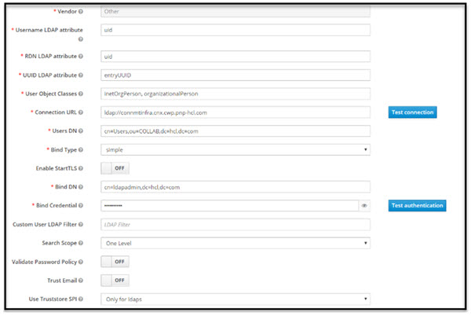       


**Creating Additional Keycloak Clients**

You create additional clients for some special case Connections applications, including mobile, desktop plugins, the rich text editor (rte) and the extended experience widget (ee). Similar to creating the main Connections client, in the Keycloak admin portal go to <Realm> > Clients > Create  and repeat for each client. 

See information and screenshots below for guidance.

**Mobile Client**  The following creates the Keycloak client for mobile there is additional Connections configuration required to complete enabling mobile access (see later section).

Set the following fields as indicated:
- Client ID:  connections_social_mobile
- Enabled:  On
- Client Protocol:  openid-connect
- Access Type: public
- Standard Flow Enabled:  On
- Implicit Flow Enabled: Off
- Direct Access Grants Enabled:  Off
- Valid Redirect URIs: com.ibm.ibmscp://com.ibm.mobile.connections/token

Under Advanced Settings, set:
- Access Token Lifespan: 60
- Proof Key for Code Exchange Code Challenge Method:  S256

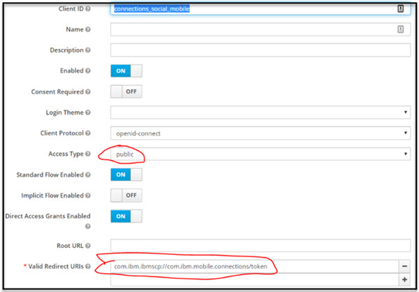


**Desktop Plugins** 

Starting in plugins release 21.07, the Mac and WIndows Desktop plugins use the same Keycloak client as Mobile (connections_social_mobile). Add the following redirect URI to the Valid Redirect URIs list of the Mobile client
Valid Redirect URIs:  `com.ibm.ibmscp://com.ibm.desktop.connections`

If you are supporting older desktop plugins (pre-21.07), you will need add another Keycloak client with ClientID conn-dsk-plugin. Other than ClientID, use the same settings as the mobile Keycloak client. Add the following redirect URI to the Valid Redirect URIs list of the conn-dsk-plugin client:
Valid Redirect URIs:  'com.ibm.ibmscp://com.ibm.desktop.connections'

***Outlook Add-in***

If you are enabling the Connections Outlook Add-in for your users, you will need to make updates to Keycloak to enable login from the add-in.

- Update the Mobile client (connections_social_mobile) with redirect URIs

  For each org supported, add the Outlook Add-in redirect URL to the ‘Valid Redirect URIs’ field. The format should be `https://<org addin URI>/auth/callback`.  Examples:
  
     - `https://orga.my.server.com/outlook-addin/auth/callback`
     - `https://orgb.my.server.com/outlook-addin/auth/callback`
- Update the ‘Web Origins’ field to allow CORS origins from the redirect URIs. Either explicitly specify each redirect URI or specify ‘+’ to allow all the redirect URIs from the ‘Valid Redirect URIs’ field.
- Update Realm settings to make sure X-Frame-Options includes “frame-ancestors 'self’”. This allows the Outlook Add-in to be loaded into the iFrame.


**RTE** 

Create a client named conn-rte and add Valid Redirect URI for each organization. For example

         https:// <server_orga>/connections/rte/connect
         hhttps:// <server_orgb>/connections/rte/connect


**EE** 

Create a client named conn-ee-kc and add Valid Redirect URI for each organization. For example

         https:// <server_orga>/connections/opensocial/gadgets/oauth2callback
         https:// <server_orgb>/connections/opensocial/gadgets/oauth2callback


**SSO between Connections, SameTime and Domino can be done via Keycloak clients**

As before create a client for all the applications in the same realm. 
**SameTime Ckient** Use IdP initiated Post binding with signed assertion:

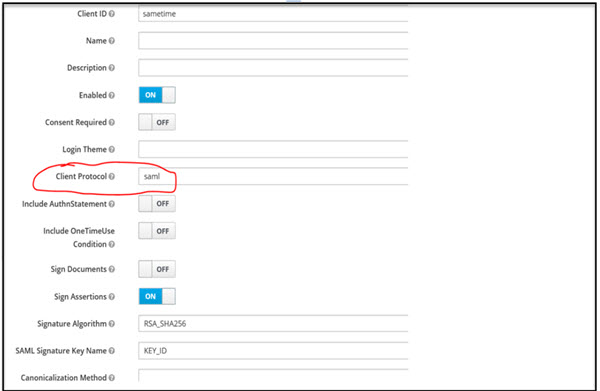
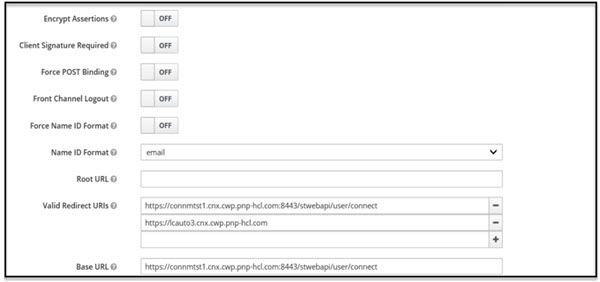


## Configuring WebSphere as OIDC Relying Party

Keycloak as an OIDC IDP provides authentication for the Connections applications installed in WebSphere.  Configuring WebSphere as the OIDC Relying Party involves a few basic steps.

- Install WebSphereOIDCRP.ear (Note: In multi-cluster environment it is installed to each cluster)
- Configure the WebSphere OIDC Trust Association Interceptor (TAI) (Note: The special steps in multi-cluster environment)
- Configure dynacache for TAI JNDI

**Install WebSphereOIDCRP.ear**
In a single cluster environment follow the instruction in step #13 Install the OpenID Connect application“ of the WebSphere Documentation.  Refer to [Configuring an OpenID Connect Relying Party](https://www.ibm.com/docs/en/was-nd/8.5.5?topic=users-configuring-openid-connect-relying-party)
See below if installing in multi-cluster environment, you will install the OIDC application on each cluster.

     Update Custom Properties: WebSphere Admin Console go to  Security > Global security > Custom properties and remove com.ibm.websphere.security.InvokeTAIbeforeSSO if it is set
     Disable Oauth TAI:  Since we are using Keycloak clients disable the com.ibm.ws.security.oauth20.tai.OAuthTAI  filter.  Go to Security > Global security > Trust association > Interceptors > com.ibm.ws.security.oauth20.tai.OAuthTAI   and set the provider_1.filter name to some dummy value so it won't intercept any requests


<br>


**Configure the WebSphere OIDC Trust Association Interceptor (TAI) – Single Cluster**
In the WebSphere Admin Console go to `Security > Global security > Trust association > Interceptors > com.ibm.ws.security.oidc.client.RelyingParty` and configure the custom TAI properties as follows


<br>

## TAI custom property

  1. Set custom `provider_1.excludedpathFilter`:  
     - `*/survey/.*,/surveys/.*,/ibm/console,/ibm/console/.*,/profiles/dsx/.*,/communities/dsx/.*,/dm,/dm/atom/seedlist,/dm/atom/communities/feed,/activities/service/atom2/forms/communityEvent,/communities/recomm/handleEvent,/communities/calendar/handleEvent,/profiles/seedlist/myserver`*`
     - **Note:** The services path may not be the same per deployment.
  2. To support JWT as access token for oauth set `provider_1.verifyIssuerInIat=true`
  3. **connmt** is the client id that was configured for the KeyCloak main Connections web client from before.
  4. connections_social_mobile is the client id for Connections Mobile
  5. To support `Mobile/oauth2` client use of the LTPA session cookie set `provider_1.setLtpaCookie=true`

**Configure the WebSphere OIDC Trust Association Interceptor (TAI) – Multi-Cluster**

A Connections medium or large deployment consists of multiple clusters (JVMs), each containing a number of applications. There is a limitation in the WebSphere OIDC RP, where the RP stores the state in local JVM. This means the Keycloak callback needs to return to the same JVM where application login started. We have the following request into [IBM to fix this issue](https://www.ibm.com/developerworks/rfe/execute?use_case=viewRfe&CR_ID=104320).  Please help by voting for it.

To resolve this issue the workaround is to install the `WebSphereOIDCRP.ear` in each cluster and configure WebSphere TAI properties for each mapping to the corresponding servlet context root. Our examples below are based on a Connections medium deployment 4 cluster configuration.

  1. Example: Deploying  WebSphereOIDCRP.ear to each JVM/cluster with unique context root.
  
     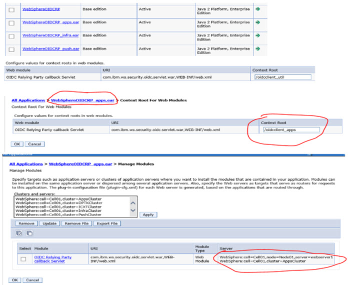

  2. Configure WebSphere TAI properties multi-cluster
     Configure `.ibm.ws.security.oidc.client.RelyingParty` TAI with a provider for each cluster and set the custom properties
     - `interceptedPathFilter` to the corresponding cluster value
     - `callbackServletContextPath` to a unique value (to be updated in Keycloak main CNX web client)

     **Note:** All properties values are the same for each provider except the `interceptedPathFilter` and `callbackServletContextPath`

     Example: For a 4 cluster medium Connections deployment setting interceptPathFilter: 
     (Note: in your environment the app may be deployed on different clusters, therefore please adjust accordingly)
     - provider_1.interceptedPathFilter: 
       `/activities/.,/blogs/.,/dogear/.,/files/.,/forums/.,/metrics/.,/metricssc/,/mobile/.,/connections/filesync/.,/connections/filediff/.,/mobileAdmin/.,/storageproxy/.,/wikis/.*` 
     - provider_2.interceptedPathFilter:
       `/connections/bookmarklet/.,/connections/oauth/.,/connections/resources/.,/connections/config/.,/communities/.,/connections/proxy/.,/help/.,/xcc/.,/selfservice/.,/news/.,/profiles/.,/search/.,/socialsidebar/.,/touchpoint/.,/connections/thumbnail/.,/connections/opengraph/.,/oauth2/.,/connections/opensocial/.`
     - provider_3..interceptedPathFilter: 
       `/homepage/.,/moderation/.,/connections/rte/.,/connections/webeditors/.`
     - provider_4.interceptedPathFilter: 
       `/push/.*`
     The screenshot below shows the TAI custom properties (provider_1) for the oidcclient_apps cluster , repeat creating the same properties for provider_2, provider_3, provider_4 with appropriate values for interceptedPathFilter and callbackServletContextPath.

      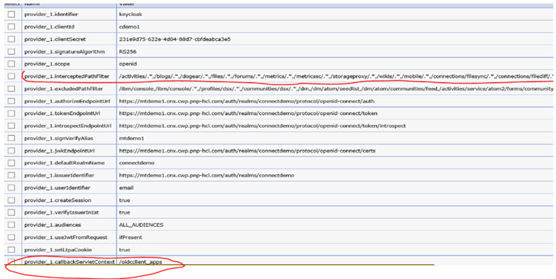

  3. Enable custom dynacache by following these steps:
     - In oidc RP TAI properties add the custom property jndiCacheName= services/cache/OpenidRpCache :
       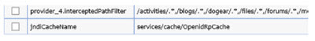   
     - Create a new object cache instance with the **JNDI name matching** the one used in the TAI property above and set 
       -- replication Domain: ConnectionsReplicationDomain
       -- replication Type: both push and pull
       
          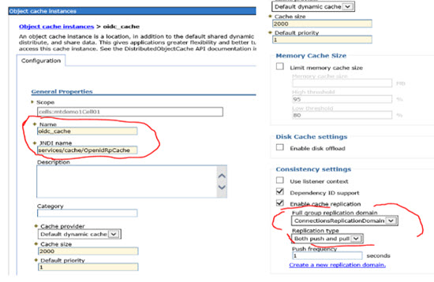
          
     - In each cluster (Apps, Infra, Util, Push) make sure that cache replication is enabled and uses the ConnectionsReplicationDomain. To check go to the Admin Console  Servers > server types > WebSphere Application Servers > <server_name> > Container Services > Dynamic cache service
       
       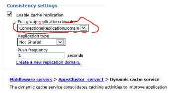

  4. In the multi-cluster case since we defined new servlet context roots in step #2, the Keycloak web/main client Valid Redirect URIs need to be updated.  
     Example: Based on our earlier Keycloak client definition update the valid callbacks as follows
     Go to Keycloak Admin Portal > realm > client > Valid Redirect URIs 
     `https://<connections host>_orga/homepage`
     `https://<connections host>_orga/oidcclient_apps/keycloak`
     `https://<connections host>_orga/oidcclient_util/keycloak`
     `https://<connections host>_orga/oidcclient_infra/keycloak`
     `https://<connections host>_orga/oidcclient_push/keycloak`
     `https://<connections host>_orgb/homepage`
     `https://<connections host>_orgb/oidcclient_apps/keycloak`
     `https://<connections host>_orgb/oidcclient_util/keycloak`
     `https://<connections host>_orgb/oidcclient_infra/keycloak`
     `https://<connections host>_orgb/oidcclient_push/keycloak`

     **Note:** oidcclient_apps, oidcclient_util, oidcclient_infra, oidcclient_push are the values of the provider_1-4.callbackServletContex custom properties in our example.

## Connections Configuration
Perform the following updates to Connections configuration files to complete enabling the Keycloak clients as the Connections OIDC provider.
**Updating the  Mobile Configuration Properties**
Update the mobile-config.xml with the property values below by following the instructions in the [Changing Mobile configuration property values](https://help.hcltechsw.com/connectionsmobile/admin/overview/t_mobile_change_config_properties.html) topic.
- Set the AuthType to OAuth:
  `<AuthType>OAuth</AuthType>`
- Set these values to the authorization and token endpoint URLs for your KeyCloak realm.  
   -- `<OAuthAuthorizationURL>https://<server>/auth/realms/<keycloak_realm>/protocol/openid-connect/auth</OAuthAuthorizationURL>`
   -- `<OAuthTokenURL>https://<server>/auth/realms/<keycloak_realm>/protocol/openid-connect/token</OAuthTokenURL>`

Verify the change is correct by selecting the URL: `https://<server>/mobile/homepage/SecurityConfiguration?debug=true` and validate that the values are reflected in the JSON that is returned.

**Updating the LotusConnections-config.xml oidc_op service**
Update the LotusConnections-config.xml for the ***serviceName="oidc_op"***  with the property values below by following the instructions found in the [Editing Configuration Files](https://help.hcltechsw.com/connections/v7/admin/admin/t_admin_common_checkout_config_file.html) topic.
**Note:** You will need to edit the LotusConnections-config.xml  file directly.

```
<sloc:serviceReference bootstrapHost="admin_replace" bootstrapPort="admin_replace" clusterName="" enabled="true" serviceName="oidc_op" ssl_enabled="true">
  	<sloc:href>
  		<sloc:hrefPathPrefix>/auth/realms/<keycloak_realm>/.well-known/openid-configuration</sloc:hrefPathPrefix>
  		<sloc:static href="http://<keycloak_server>" ssl_href="https://<keycloak_server>"/>
  		<sloc:interService href="https://<keycloak_server>"/>
  	</sloc:href>
  </sloc:serviceReference>
```

