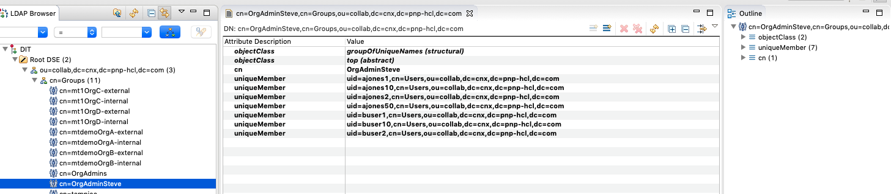
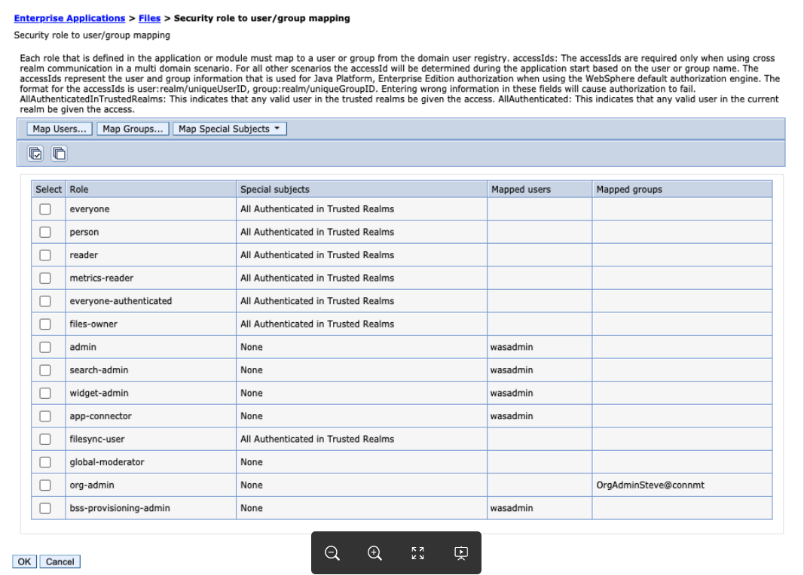
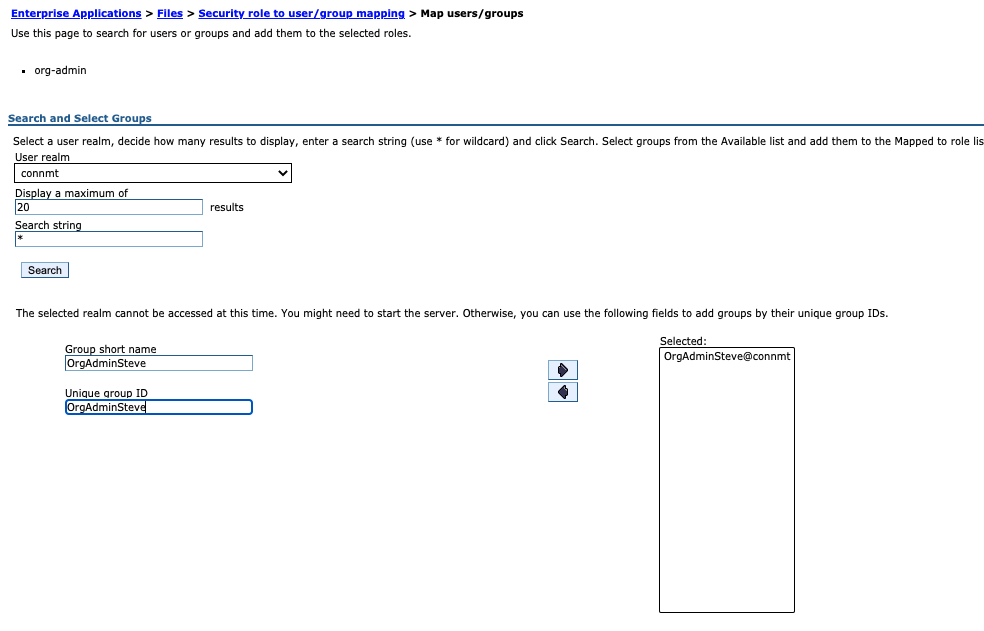
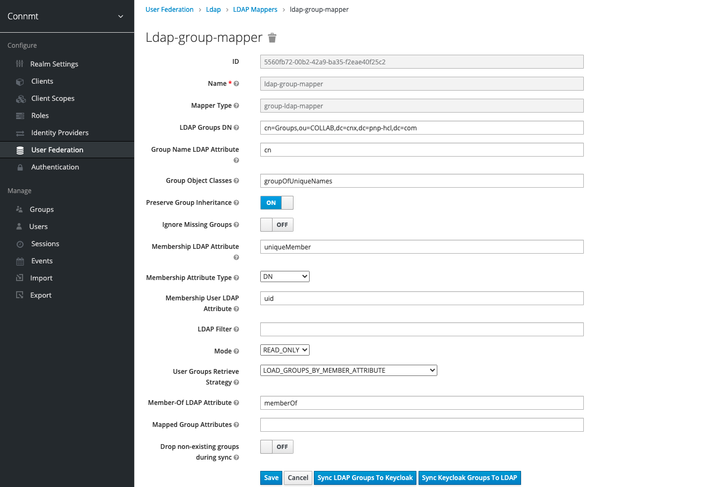

# Providing LDAP Group Support for the org-admin role in MT

This information allows MSPs to create an LDAP group that contains the individuals with org admin privileges.

## Synchronize the LDAP groups

1. Log into your keycloak server to sync the group with keycloak.
2. Select your realm. For example, connmt.
3. Select **User Federation**
4. Select the LDAP you are using.
5. Select Mappers and select ldap-group-mapper
   - If the ldap-group-mapper does not exist, create the mapper first and associate it with the Groups DN in your LDAP.
7. Select **Sync LDAP Groups To Keycloak**

## Add the groupIds claim to the tokens

1.  As your keycloak administrator, within your realm, navigate to Client Scopes > roles > Mappers.
2.  Create a Token Mapper called "Group Membership" or some understandable name, with a Mapper Type of **Group Membership**.
3. Set the Token Claim name to be **groupIds**.
4. Disable Full Group path.
5.  Ensure the claim is added to the ID and access token.
6. Save the mapper.

## Updating the OIDC Relying Party TAI

1. As the WebSphere administrator, using the WebSphere administration portal and navigate to Security > Global Security > Trust Association > Interceptors > com.ibm.ws.security.oidc.client.RelyingParty
2. Ensure that each provider listed has a property for groupIdentifier with a value of groupIds.  For example, provider_1.groupIdentifier = groupIds
3. If any changes are required, sync all nodes and restart the servers.
    
    
## Adding groups to the org-admin role for application
1. Create a group in LDAP that MSP manages for their customers, that consists solely of those users that would be designated  as the organization administrator by their company. The following screen capture displays an example of an LDAP group.  In the left panel, a group called OrgAdminSteve is displayed and in the right panel the members of that group are displayed. The group consists of users across all organizations.  When adding users to the group, they are added as uniqueMembers and the value is the the user's DN as it comes from the flat list of all users.
   
      **Note:**  Use the “flat” DN from the overall list of users when using a tool like apache directory studio
2.  Add the group that you  created in the LDAP via the WebSphere Admin Console to each application that requires org-admin access.  For example, Communities, Blogs, Files, Wikis, Forums, etc.   
    
3.  Select **Map Groups**, you may or may not be able to select the group from the picker, but you will need to insure that you select or enter the groups that belong to the realm that you have configured via Keycloak. For this example, **connmt**.
    
4.  Before your group will be operational, you will need to synchronize the new group via Keycloak.
    
 
