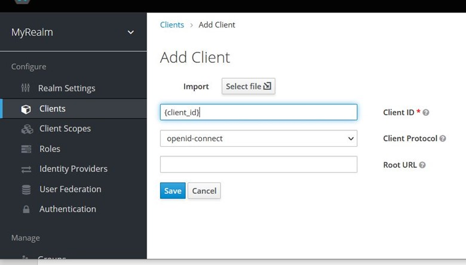
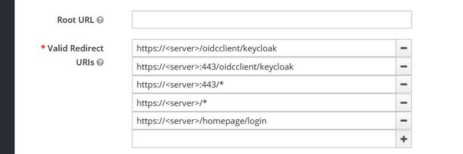
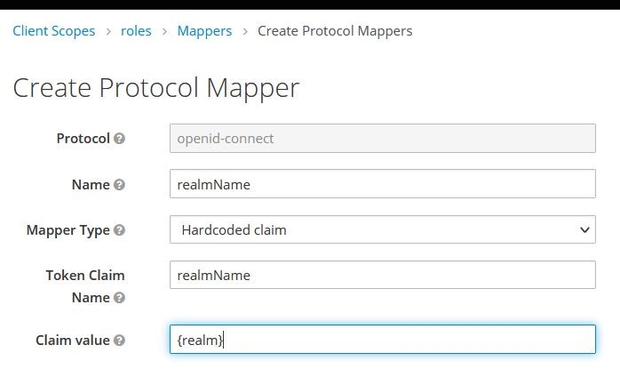
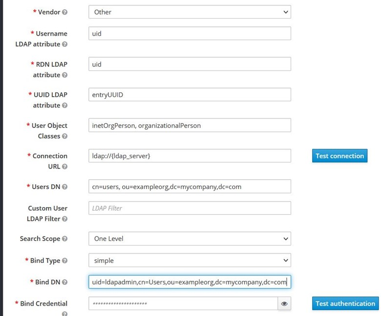
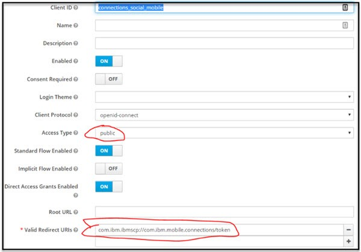

# Configuring KeyCloak as an OIDC provider for Connections {#t_keycloak_config_conn_oidc .concept}

Configuring Keycloak as the OIDC provider for Connections involves these steps.

- Creating a realm
- Configure the callback urls for the client within that realm create a client for the Connections web application
- Configure hardcoded realmName claim through the client scope mapper property
- Configure Keycloak connection to LDAP
- Create additional clients for Oauth applications mobile and desktop plugins
 
The realm contains the Keycloak OIDC clients which provide the authentication for Connections entities. The main OIDC client is the client for the Connections web application.

## Procedure {#section_yyb_25x_bpb .section}

1.  To create the Connections Realm in Keycloak, in the Keycloak admin portal Select realm > Add realm. This documentation references the realm name created here as {realm} .
2.  Once created set the realm token properties as appropriate for your deployment via **{realm}** > **Realm Settings** > **Tokens** 
    **Note:** To avoid token time-out issues set the properties Access Token Lifespan and Access Token Lifespan For Implicit Flow to 1 minute less than the WebSphere LTPA timeout.  

    
 For example, if the WebSphere LTPA timeout is set to 720 minutes (12 hours) 

    <ol> <li>set the property Access Token Lifespan to 719 minutes </li>
    <li>set the property Access Token Lifespan For Implicit Flow to 719 minutes. </li>
    </ol>
 
3. Create the Main Keycloak Client for Connections. Click on **Keycloak admin portal** and select **{realm}** > **Clients**. 
4. Click **Create**.
    
 **Note:** {client_id} will also be used later in the [Updating WebSphere to support Keycloak OIDC Authentication for Connections](t_keycloak_oidc_websphere.md) section

5. As part of the client, define the valid callback urls. 
   
   
 **Note:** <filepath> oidcclient/keycloak </filepath> corresponds to property values from the WebSphere TAI referenced later. Specifically, oidcclient is the value of the property <codeph>provider_x.callbackServletContext</codeph> and keycloak is the value of the property <codeph>provider_x.identifier</codeph>. 

6.  Next create a Client Scope Mapper for realmName in the **Keycloak admin portal**. Go to **{realm}** > **Client Scopes** > **roles** > **Mappers** > **Create**.
   

7.  Click **Create**.

8.  Fill in the following fields with the values below and click **Save**.
<ol><li>**Name** = realmName </li> <li>**Mapper Type** = Hardcoded claim </li><li>**Token claim name** = realmName</li><li>**Claim value** = {realm}</li></ol>
**Note:** This creates a mapper that provides the realmName as part of the ID and access tokens in the authentication flow. Doing this via the realm's client scope makes it available to all client authentication flows in that same realm including web (defined above), mobile, desktop and 3rd party clients. 

  
9.  Configuring KeyCloak to connect to the enterprise’s LDAP enables Keycloak to provide authentication for the enterprise's users. Informing Keycloak about the users is simple. To do this, go to **{realm}** > **User Federation** > **Add Provider** in the **Keycloak admin portal** .
10. Choose ldap and complete the form like the following example. 
11. Create additional clients for the Connections mobile and desktop plugins applications. Similar to creating the main Connections client, in the **Keycloak admin portal** go to  **Clients** > **Create**. Repeat for each client. 
 See the information and screenshots below for guidance. 
 <section>**Mobile Client** </section> The following creates the Keycloak client for mobile, there is additional Connections configuration required to complete enabling mobile access (see later section). 
 Set the values for the following fields as indicated:

<ol><li>**Client ID** =  connections_social_mobile</li><li>**Enabled** = On</li><li>**Client Protocol** = openid-connect</li><li>**Access Type** = public</li><li>**Standard Flow Enabled** = On</li><li>**Implicit Flow Enabled** = Off</li><li>**Direct Access Grants Enabled** = Off</li><li>**Valid Redirect URIs** = com.ibm.ibmscp://com.ibm.mobile.connections/token</li></ol>

Under Advanced Settings, set:
<ol><li>**Access Token Lifespan** = 60</li><li>**Proof Key for Code Exchange Code Challenge Method** = S256</li></ol><section>**Desktop Plugins**</section>
Both Mac and Windows Desktop plugins use the same Keycloak client as the Mobile that is defined above (connections_social_mobile). Add the following redirect URI to the Valid Redirect URIs list of the Mobile client Valid Redirect URIs: 
<filepath>com.ibm.ibmscp://com.ibm.desktop.connections</filepath>

**Note:** If you are supporting older desktop plugins (pre-21.07): 
<ul><li> Add another Keycloak client with ClientID: conn-dsk-plugin </li><li>Other than ClientID, use the same settings as the mobile Keycloak client </li><li>Add this redirect URI to the Valid Redirect URIs list of the conn-dsk-plugin client: 
Valid Redirect URIs: <filepath>'com.ibm.ibmscp://com.ibm.desktop.connections' </li></ul>
 

 
</li>
12. **Outlook Add-in:** 
If you are enabling the Connections Outlook Add-in for your users, you will need to make updates to Keycloak to enable login from the add-in. Update the Mobile client (connections_social_mobile) with redirect URIs

<ul><li>Add the Outlook Add-in redirect URL to the ‘Valid Redirect URIs’ field. The format should be <xref>https://(addin URI)/auth/callback </xref> For Example: <xref>https://my.server.com/outlook-addin/auth/callback</xref></li><li>Update the ‘Web Origins’ field to allow CORS origins from the redirect URIs. Either explicitly specify each redirect URI or specify ‘+’ to allow all the redirect URIs from the ‘Valid Redirect URIs’ field.</li><li>Update {realm} settings to make sure X-Frame-Options includes “frame-ancestors 'self’”. This allows the Outlook Add-in to be loaded into the iFrame.</ul>

</ol>

**Parent topic:** [Enabling Keycloak as an OIDC provider for Connections](../secure/c_keycloak_oidc.md)

